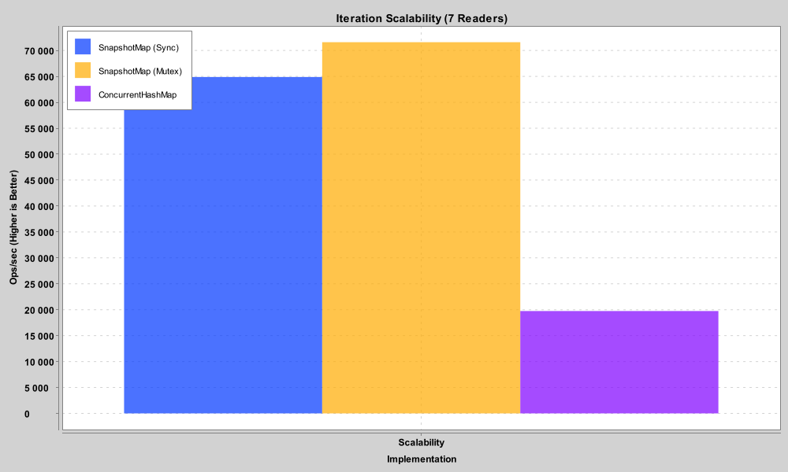
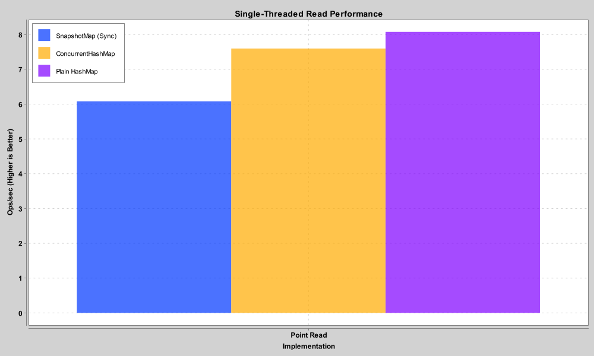
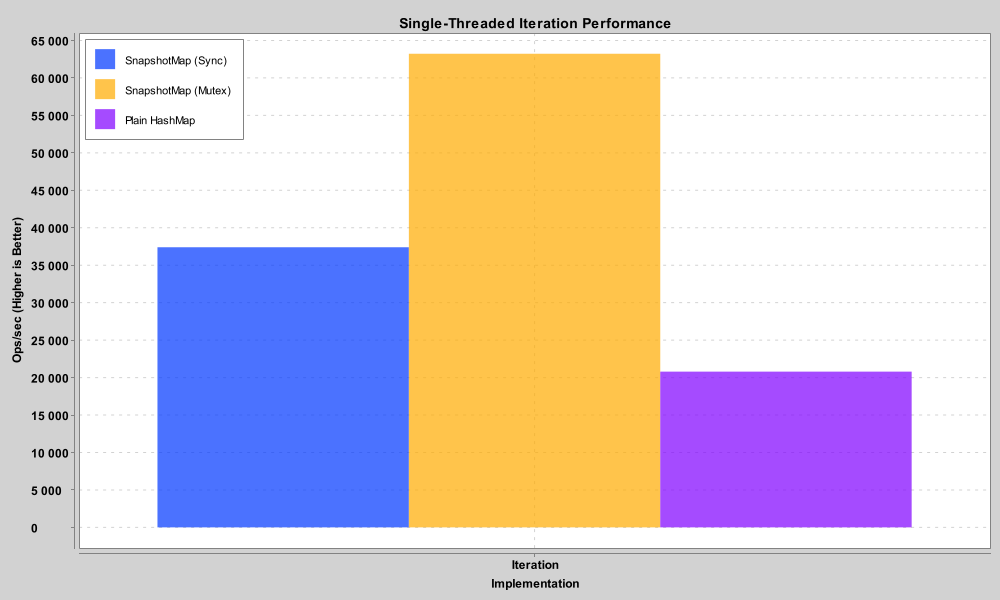
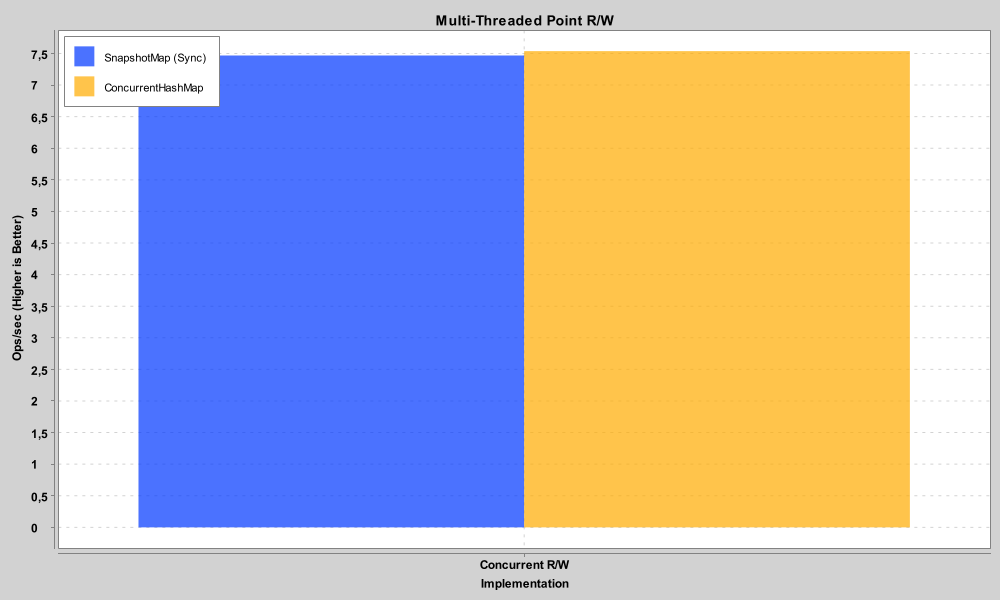

# SnapshotMap

[](https://www.codefactor.io/repository/github/mrlarkyy/snapshotmap)
[](https://repo.aquatic.gg/#/releases/gg/aquatic/snapshot-map)

[](https://discord.com/invite/ffKAAQwNdC)

A read-optimized `MutableMap` wrapper for Kotlin/JVM.

`SnapshotMap` targets workloads where iteration (`forEach`) is frequent but modification is occasional. It keeps an
internal array snapshot for lock-free iteration, which in read-heavy tests outperforms `ConcurrentHashMap` (see
[benchmarks](#performance-benchmarks)).

## Features

- **Allocation-free iteration:** Once the snapshot is cached, `forEach` performs no allocations and avoids `Map.Entry`
  overhead.
- **Cache-friendly layout:** Data is stored in contiguous arrays for better cache locality during full-map scans.
- **Lock-free reads:** Point lookups (`get`) delegate directly to the underlying map.
- **Lazy invalidation:** Snapshots are rebuilt only when data actually changes, avoiding redundant work on no-op writes.
- **Coroutine variant:** `SuspendingSnapshotMap` uses a `Mutex` for non-blocking iteration in async code.

---

## When to use SnapshotMap

`SnapshotMap` is a specialized tool, not a drop-in replacement for `ConcurrentHashMap` in every scenario.

### Which implementation to choose

*   **`SnapshotMap`**: For standard threaded applications. It uses `synchronized` for snapshot rebuilding.
*   **`SuspendingSnapshotMap`**: For Kotlin coroutines (e.g. Ktor, Quarkus). It uses a `Mutex`, so threads are not
    blocked during a snapshot rebuild.

### Use SnapshotMap when

* **Read/iteration heavy:** You call `forEach` far more often than `put` or `remove`.
* **High thread contention:** Multiple threads iterate the map at once, where `SnapshotMap` avoids the locking overhead
  of standard concurrent collections.
* **Data changes in bursts:** Data updates at intervals (e.g. a game tick or a periodic config reload).
* **Large scans:** You iterate over thousands of items, where the flat-array cache benefit is noticeable.

### Avoid SnapshotMap when

* **Write-heavy:** If you modify the map as often as you read it, the cost of rebuilding the array makes it slower than
  `ConcurrentHashMap`.
* **Memory constrained:** The map keeps a cached copy of keys and values in arrays, roughly doubling reference memory
  usage.

---

## Performance Benchmarks

JMH tests with 100,000 items, comparing read-heavy workloads. Results vary by machine and workload.

### 1. Iteration Scalability

*Measured with 7 threads iterating and 1 thread performing occasional writes (100ms interval).*
Once the snapshot is cached, `SnapshotMap` is about 2.5x faster than `ConcurrentHashMap`. `SuspendingSnapshotMap`
performs close to the synchronous version thanks to `inline` optimization.



### 2. Single-Threaded Baseline (vs HashMap)

In a single-threaded environment, `SnapshotMap` trades some point-lookup speed for faster scans. It is about 50% faster
in iteration due to cache locality, but about 30% slower in point reads because of delegation and thread-safety
overhead.

|  Point-Read Performance (HashMap Wins)  |   Iteration Performance (SnapshotMap Wins)   |
|:---------------------------------------:|:--------------------------------------------:|
|  |  |

### 3. Multi-Threaded Point R/W

*Standard point-lookups remain highly competitive with native `ConcurrentHashMap` performance.*



---

## Usage

### Installation

Add the library to your project:

````kotlin
repositories {
    maven("https://repo.aquatic.gg/releases")
}

dependencies {
    implementation("gg.aquatic:snapshot-map:26.0.54")
}
````

### Basic Example (Blocking)

```kotlin
// Wraps any ConcurrentHashMap (defaults to a new one)
val map = SnapshotMap<String, Int>()

// Snapshot-optimized iteration
map.forEach { key, value ->
    println("$key -> $value")
}
```

### Coroutine Example (Non-Blocking)

```kotlin
val map = SuspendingSnapshotMap<String, Int>()

// Inside a coroutine scope
suspend fun processData() {
    // Non-blocking iteration using Mutex
    map.forEachSuspended { key, value ->
        println("Processing $key")
    }
}
```

---

## Community & Support

- Discord: [Aquatic Development](https://discord.com/invite/ffKAAQwNdC)
- Issues: open a ticket on GitHub for bugs or feature requests.
